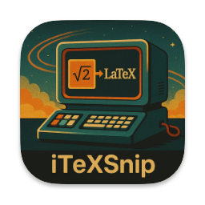

# iTeXSnip

Image -> LaTeX




Works with handwritten formulae as well!

## TODO

### V1

- [x] Rating API
- [x] Preferences
    - Model load preferences
    - Detailed view preferences
    - Rating API server
- [x] Complete Detailed Snippet View

### V2
- [ ] Math Solver
- [ ] TeX Snippet Editor
- [ ] Image Export
- [ ] UI Overhaul
- [ ] Optimizations

## Misc

### Quantization

#### Encoder Model

```bash
python -m onnxruntime.quantization.preprocess --input  iTexSnip/models/encoder_model.onnx --output  encoder-infer.onnx
```

```python
import onnx
from onnxruntime.quantization import quantize_dynamic, QuantType
og = "encoder-infer.onnx"
quant = "encoder-quant.onnx"
quantized_model = quantize_dynamic(og, quant, nodes_to_exclude=['/embeddings/patch_embeddings/projection/Conv'])
```

It might be better if we quantize the encoder using static quantization.

#### Decoder Model

```bash
python -m onnxruntime.quantization.preprocess --input  iTexSnip/models/decoder_model.onnx --output  decoder-infer.onnx
```

```python
import onnx
from onnxruntime.quantization import quantize_dynamic, QuantType
og = "decoder-infer.onnx"
quant = "decoder-quant.onnx"
quantized_model = quantize_dynamic(og, quant)
```
